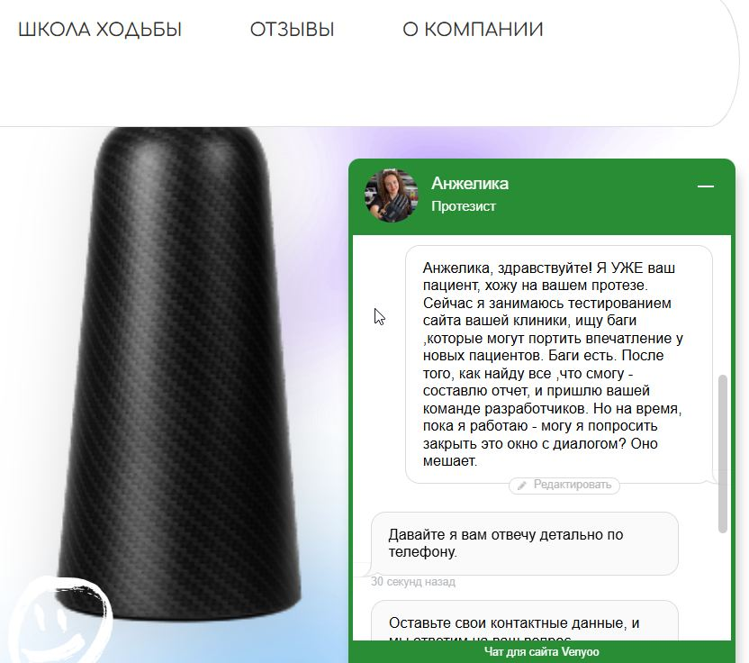

# BUG-006. Чат-бот маскируется под живого сотрудника

## Где
Все страницы сайта, всплывающее окно чата (Venyoo).

## Шаги воспроизведения
1. Открыть любую страницу сайта https://instep.spb.ru
2. Дождаться появления всплывающего окна чата
3. Написать любой вопрос
4. Попробовать закрыть окно

## Ожидаемый результат
1. Пометка «Виртуальный помощник» или «Автоответчик».
2. Кнопка закрытия окна.
3. Ответ по существу, без обязательного требования телефона.

## Фактический результат
1. Окно оформлено как диалог с живым человеком: фото, имя «Анжелика», должность «Протезист».
2. Кнопки закрытия нет — окно перекрывает контент.
3. Бот отвечает шаблоном: «Давайте я вам отвечу детально по телефону. Оставьте свои контактные данные».
4. Задать вопрос без оставления телефона нельзя.

## Серьёзность
Major

## Приоритет
Высокий

## Влияние
- Снижение конверсии: пользователи уходят, не оставив заявку.
- Риск жалоб на спам после передачи контактов.
- Окно нельзя закрыть — мешает пользоваться сайтом.

## Скриншот

